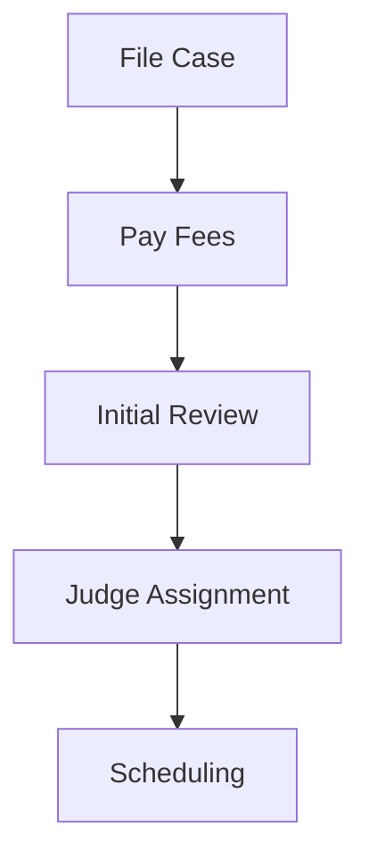
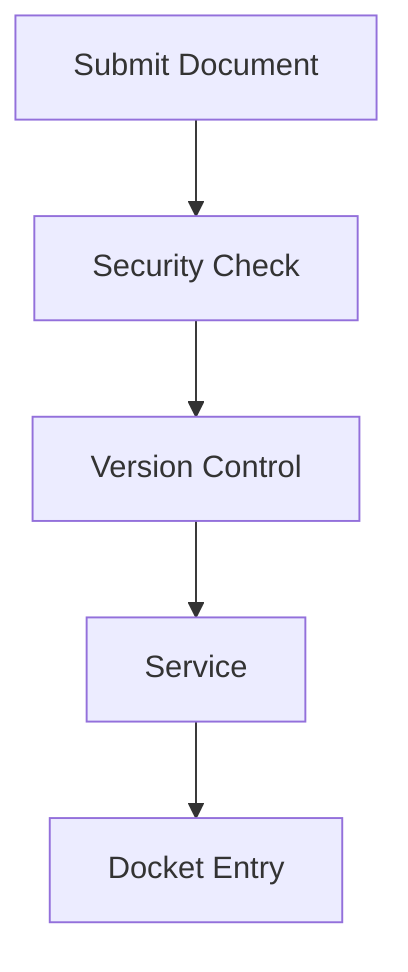
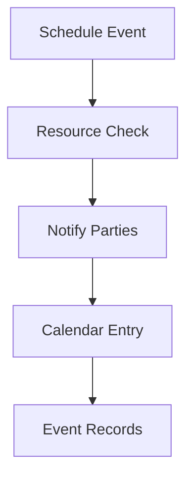

# Court Case Management System Documentation 📚

## System Overview 🏛️

This system manages federal court cases, providing comprehensive tracking of cases, documents, workflows, and all related activities within the judicial system.

### Core Components

1. **User Management & Authentication** 👥
   - Roles: Judge, Attorney, Clerk, Admin
   - Security clearances and access control
   - Two-factor authentication support

2. **Court Structure** 🏢
   - Multiple court types: Supreme, Appellate, District
   - Jurisdictional hierarchy
   - Judicial officer assignments

3. **Case Management** 📋
   - Case filing and tracking
   - Party management
   - Document management
   - Status tracking
   - Deadlines and schedules

4. **Document System** 📄
   - Version control
   - Electronic signatures
   - Security classifications
   - Access logging

5. **Calendar & Scheduling** 📅
   - Court events
   - Resource management
   - Conflict checking
   - Participant tracking

6. **Workflow Management** ⚙️
   - Customizable workflows
   - Task assignments
   - Status tracking
   - Automated notifications

## Sample Data Overview

### Cases
- US v. Google LLC (1:20-cv-03010)
  - Antitrust case
  - Multiple parties and attorneys
  - Complex document structure
- Epic Games v. Apple Inc. (3:20-cv-05640)

### Users & Roles
- Judges (Roberts, Ginsburg, Breyer)
- Attorneys (Katyal, Goldstein, Clement)
- Court Staff (Clerk Kagan)
- System Admin (Smith)

### Document Types
1. **Pleadings**
   - Complaints
   - Answers
   - Motions

2. **Orders**
   - Court Orders
   - Scheduling Orders
   - Opinions

3. **Discovery**
   - Requests for Production
   - Interrogatories
   - Expert Reports

### Financial Tracking
- Filing Fees
- Payment Processing
- Fee Waivers
- Transaction History

### API Integration
- Authentication via API Keys
- Rate Limiting
- Usage Tracking
- Access Control

## Key Workflows

### 1. Case Filing Process

### 2. Document Filing

### 3. Court Events

## Security Model

1. **Access Levels**
   - Public
   - Sealed
   - Classified

2. **Document Control**
   - Version tracking
   - Access logging
   - Security classification

3. **API Security**
   - Key-based authentication
   - Role-based permissions
   - Rate limiting
   - Usage monitoring

## Reporting & Analytics

1. **Case Statistics**
   - Filing trends
   - Resolution rates
   - Timeline analysis

2. **Workload Analysis**
   - Judge assignments
   - Case complexity
   - Resource utilization

3. **System Usage**
   - API usage patterns
   - Document access patterns
   - User activity tracking
